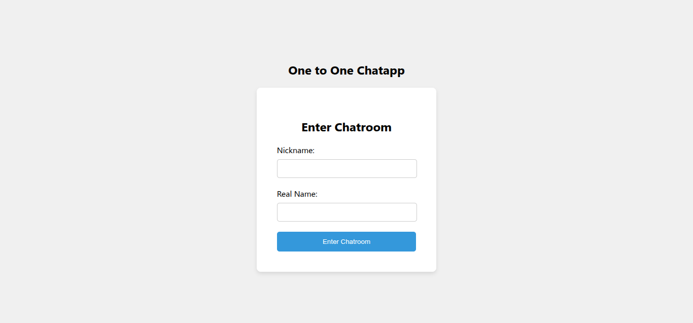
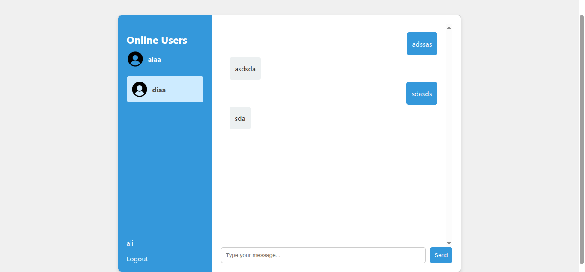

# 💬 One-on-One Chat Application | Spring Boot & WebSocket

A real-time **one-on-one chat application** built using **Spring Boot**, **WebSocket**, and **MongoDB**.  
This project enables private and persistent communication between users with smooth real-time message delivery.

---

## 🚀 Overview

This project is a personal implementation inspired by a WebSocket tutorial.  
It focuses on **real-time communication**, **secure private chats**, and **data persistence** using MongoDB.

The app demonstrates how to:
- Establish WebSocket connections.
- Handle private one-to-one messaging.
- Persist chat messages in MongoDB.
- Manage connected users dynamically.

---

## 🖼️ Application Screenshots

| Chat Page | Online Users |
|------------|--------------|
|  |  |

---

## ⚙️ Features

- 🔒 One-to-one secure private chat  
- 💬 Real-time WebSocket communication  
- 🧩 MongoDB persistence (stores all messages)  
- 👥 Dynamic list of connected users  
- ⚡ Built with Spring Boot 3 and STOMP over WebSocket  

---

## 🧠 WebSocket Chat Flow

1. Client connects to WebSocket endpoint  
2. User subscribes to their private queue  
3. When a message is sent, the server routes it to the target user’s queue  
4. The receiver gets it instantly in real-time  
5. Messages are saved in MongoDB for persistence  

---
🧰 Technologies Used

Spring Boot 3.x.x – backend framework

WebSocket (STOMP) – real-time communication

MongoDB – database for storing messages

HTML / CSS / JavaScript – frontend UI

📚 Acknowledgment

This project was built following the tutorial by Alibou as a learning exercise.
All code was re-implemented and customized by Alaa for personal practice and deeper understanding.

---

## 🛠️ Installation & Setup

Follow these steps to run the project locally:

```bash
# 1️⃣ Clone the repository
git clone https://github.com/<your-username>/one-on-one-chat-app.git

# 2️⃣ Navigate to the project directory
cd one-on-one-chat-app
cd backend

# 3️⃣ Build the project
./mvnw clean install

# 4️⃣ Run the application
./mvnw spring-boot:run

Then open your browser and visit:

http://localhost:8080
